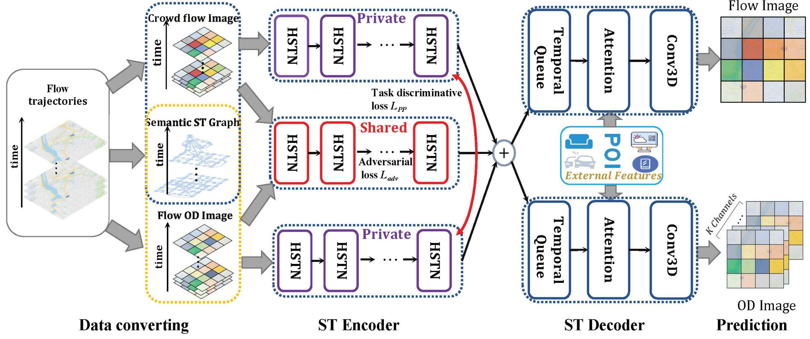

# Multi-task Adversarial Spatial-Temporal Networks for Crowd Flow Prediction(MT-ASTN)

A simple version of Pytorch implementation of [Multi-task Adversarial Spatial-Temporal Networks for Crowd Flow Prediction](https://github.com/MiaoHaoSunny/MT-ASTN/blob/master/Paper/paper.pdf) published in CIKM2020 where Self-attention module was replaced by a simple attention mechanism.

<p align="center">
    
</p>

## Requirements

```
Numpy
scipy
Python 3.6+
Pytorch 1.0+
Matplotlib(Optional)
```

## Citation
Please cite the following paper if you use this repository in your reseach.
```
@inproceedings{wang2020multi,
  title={Multi-task Adversarial Spatial-Temporal Networks for Crowd Flow Prediction},
  author={Wang, Senzhang and Miao, Hao and Chen, Hao and Huang, Zhiqiu},
  booktitle={Proceedings of the 29th ACM International Conference on Information \& Knowledge Management},
  pages={1555--1564},
  year={2020}
}
```

## Contact
The code might be a little messy. For any question, feel free to contact:
```
Hao Miao: haomiao96@gmail.com
Senzhang Wang: szwang@nuaa.edu.cn
```
